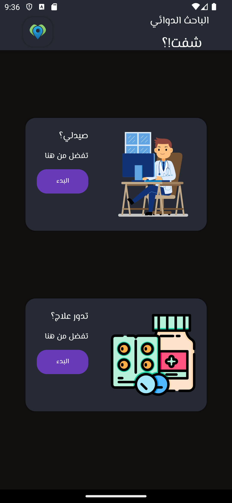
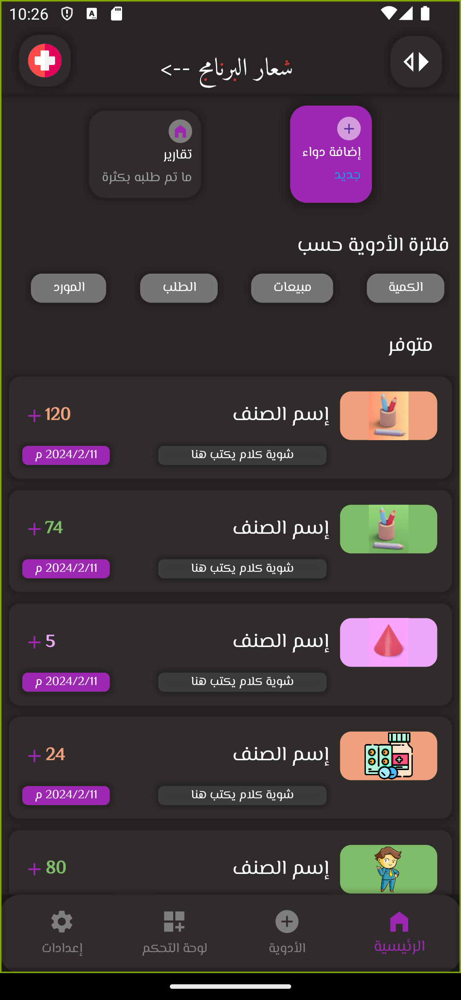
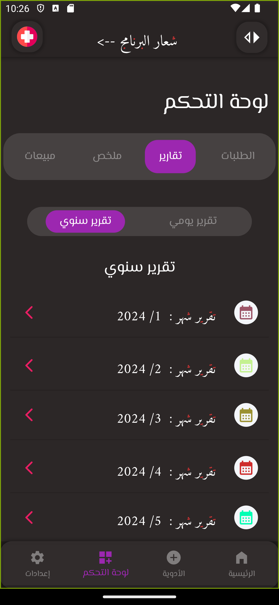
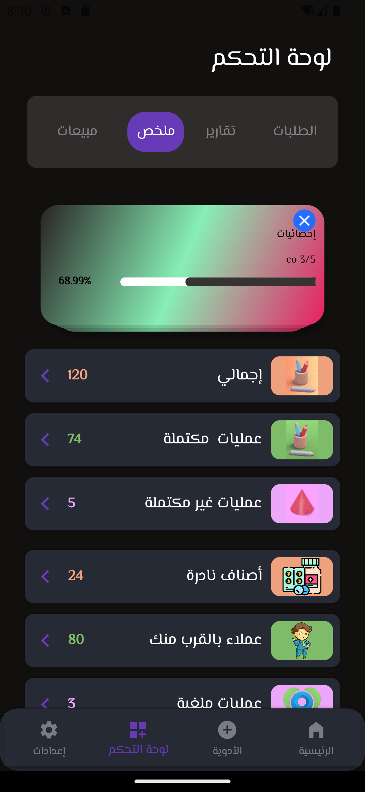
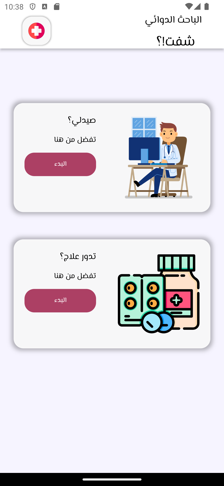
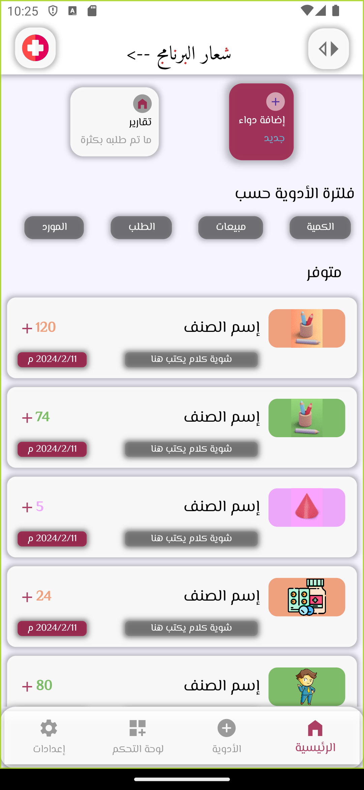
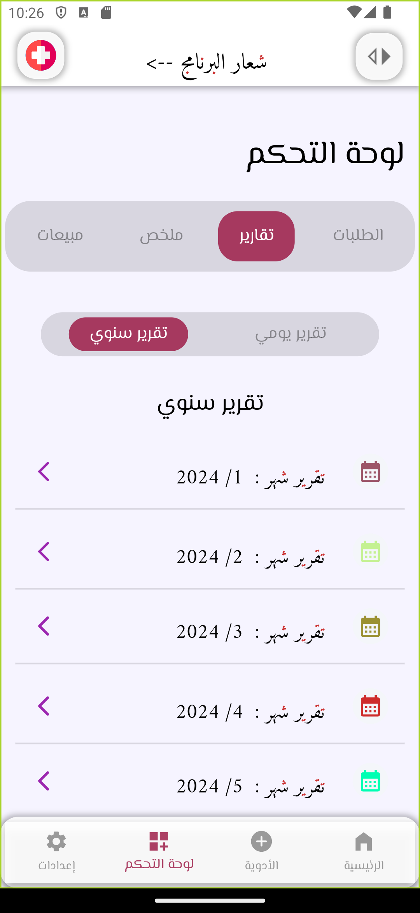
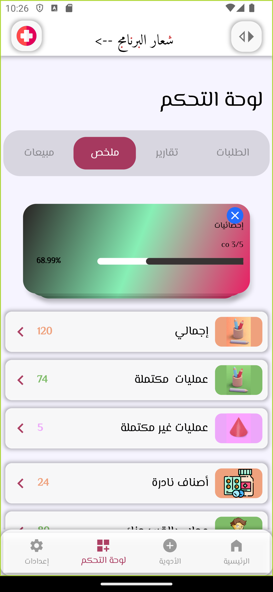

# ModWir - Group 3 Graduation Project in Ibb City - Yemen

Medical app UI Design Flutter .
# ScreenShots 
 Dark Theme  |                                                   
:------------:

  
   
   
    

| Light Theme|                                                   
:------------:

  
   
   
    

## Getting Started

- [Text me in Public Whatsapp](https://wa.me/+967775992377)
- [Instagram ](https://www.instagram.com/m.7vd/)

# Installation: 
    Steps:
      step 1:
              git clone https://github.com/mohajuwa/medh2.git
      step 2:
              pub get
      step 3: 
              change the version of flutter in your file(pupspec.yaml)
              

# Done
